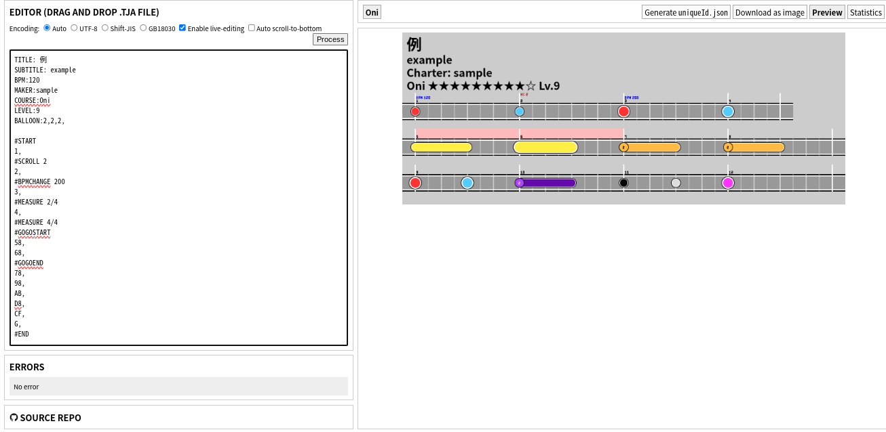

# TJA Tools

[中文](README.md) English

A tool to visualize `.tja` chart files. Forked from [Snack](https://github.com/Snack-X)'s [tja-tools](https://github.com/Snack-X/tja-tools).

## Run

Visit https://whmhammer.github.io/tja-tools

## Build

Install Node: https://nodejs.org/en/download, and then execute the following commands:

```
git clone https://github.com/WHMHammer/tja-tools
cd tja-tools
npm i
npm run build
```

You shall then open `webpack-dist/index.html` (not `src/index.html`) with your web browser or execute `npm start`

## Examples




## Progress

- [x] Manual Selection of file encoding
- [ ] Show different branches side-by-side
- Meta (common)
    - [x] `TITLE`
    - [x] `SUBTITLE`
    - [x] `BPM`
    - [x] `MAKER`
    - [ ] `GENRE`
- Meta (course-specific)
    - `COURSE`
        - [x] `Easy` / `0`
        - [x] `Normal` / `1`
        - [x] `Hard` / `2`
        - [x] `Oni` / `3`
        - [x] `Edit` / `Ura` / `4`
        - [ ] `Tower` / `5`
        - [ ] `Dan` / `6`
    - [x] `LEVEL`
    - [x] `BALLOON`
    - [ ] `STYLE`
    - [x] `NOTESDESIGNER0` - `NOTESDESIGNER6` (only 0-4 are recognized)
    - [x] `TTROWBEAT` (for visualizing, maximum # of beats in one line)
- Notes
    - [x] `0` (empty)
    - [x] `1` (Don)
    - [x] `2` (Ka)
    - [x] `3` (DON)
    - [x] `4` (KA)
    - [x] `5` (Drumroll starts)
    - [x] `6` (DRUMROLL starts)
    - [x] `7` (Balloon starts)
    - [x] `8` (drumroll/balloon ends)
    - [x] `9` (BALLOON starts)
    - [x] `A` (partner Don)
    - [x] `B` (partner Ka)
    - [x] `C` (Bomb)
    - [x] `D` (Fuse)
    - [x] `F` (ADLIB)
    - [x] `G` (Green/Purple)
    - [ ] `H` (DRUMROLL or Don-roll)
    - [ ] `I` (Drumroll or Ka-roll)
- Commands
    - [x] `#START`
    - [x] `#END`
    - [x] `#MEASURE`
    - [x] `#BPMCHANGE`
    - [ ] `#DELAY`
    - [x] `#SCROLL`
    - [x] `#GOGOSTART`
    - [x] `#GOGOEND`
    - [x] `#BARLINEOFF`
    - [x] `#BARLINEON`
    - [x] `#BRANCHSTART` (only the highest branch is displayed)
    - [x] `#N`
    - [x] `#E`
    - [x] `#M`
    - [x] `#BRANCHEND`
    - [ ] `#LYRIC`
    - [ ] `#LEVELHOLD`
    - [ ] `#NEXTSONG`
    - [x] `#TTBREAK` (for visualizing, wrap at the start of this measure)

# Acknowledgement

- [Snack](https://github.com/Snack-X): The original author of the project
- [申しコミ](https://github.com/0auBSQ): Added support to `A`,`B`,`C`,`F`, and `G`notes
