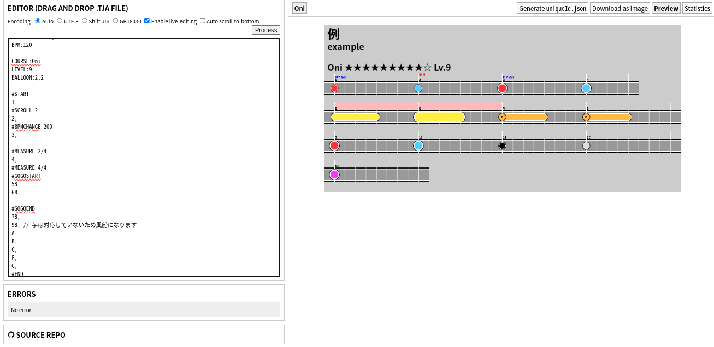

# TJA tools

[中文](README-CH.md) [English](README-EN.md)

TJAファイルを譜面画像へ変換します。[snack](https://github.com/Snack-X)の[tja-tools](https://github.com/Snack-X/tja-tools)からフォークしています。

# Run
https://whmhammer.github.io/tja-tools

# 作成
Node: https://nodejs.org/zh-cn/download をインストールし、以下のコマンドを実行します
```
git clone https://github.com/WHMHammer/tja-tools
cd tja-tools
npm i
npm run build
```
次に、ブラウザでwebpack-dist/index.html（src/index.htmlではない）を開くか、npm startを実行します

# 例



# 進捗
